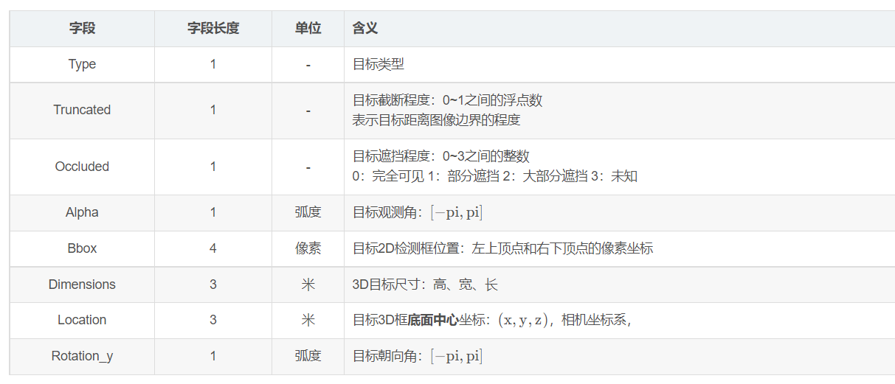

# 1.整体介绍
官网：http://www.cvlibs.net/datasets/kitti/

参考链接：
- raw data介绍：https://blog.csdn.net/zhanghm1995/article/details/88086517
- detection 介绍：https://blog.csdn.net/qq_16137569/article/details/118873033

# 2.场景分类
## 2.1 [raw data](http://www.cvlibs.net/datasets/kitti/raw_data.php)
原始数据包含以下六个场景类别：
City | Residential | Road | Campus | Person | Calibration

后序具体任务都是由该raw data中抽取组合而来。

每个场景都有多段数据， 数据内容包含以下：传感器（同步矫正结果）， 标定参数， cuboid标注

## 2.2 [Object Detection](http://www.cvlibs.net/datasets/kitti/eval_object.php?obj_benchmark=2d)
该任务包括三个子任务，2D检测，3D检测，bev检测， 这些任务用到的数据集都一样，包括如下：

标定信息解释：

文件解析参考：https://blog.csdn.net/QFJIZHI/article/details/103682310